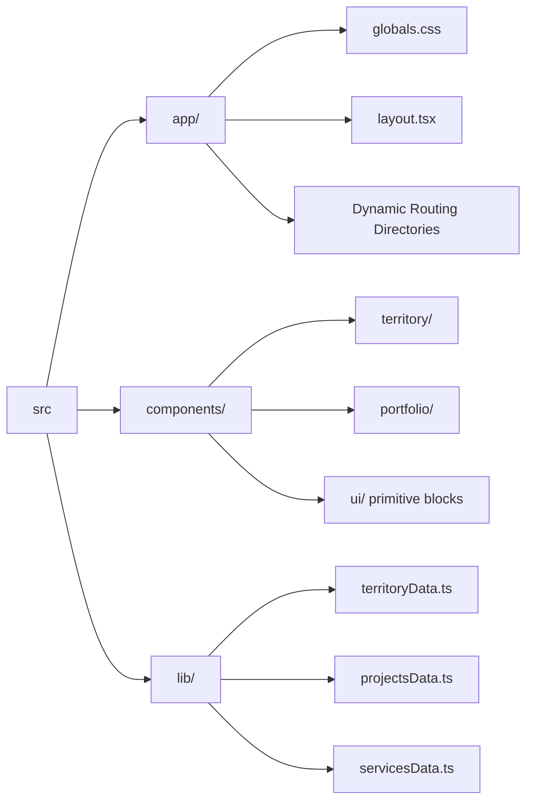

# Emperor Sami Group | Luxury Custom Home Builders

A high-fidelity, ultra-performance frontend architecture powering the digital presence of the **Emperor Sami Group**—the premier luxury construction and architectural renovation firm controlling the Greater Toronto Area (GTA).

Built with an uncompromising focus on 60FPS cinematic mobile animations, massive brutalist-minimalist UI components, and strict 100/100 Lighthouse performance metrics.

---

## 🏛️ Core Technology Stack

- **Framework**: `Next.js 15+` (App Router & React 19)
- **Styling Engine**: `Tailwind CSS v4` (Using natively injected `@theme inline` variables)
- **Typography Engine**: `Geist` & `Geist Mono` standard matrix
- **Third-Party Execution**: `Builder.io Partytown` (Headless Web Worker containment)
- **Interaction Libraries**:
  - `Swiper.js` (For heavily optimized mobile touch-slider grids)
  - `Native CSS Physics` (Sticky scroll staggering, 3D card overlaps, GPU-accelerated touch-pan mechanics)

---

## 🗺️ Application Architecture

The application is engineered around a centralized "Trust Funnel" component pipeline that injects high-converting, heavily optimized UI modules into both static and deeply dynamic routes based on territorial JSON arrays.

```mermaid
graph TD
    classDef primary fill:#111,stroke:#D8A02A,stroke-width:2px,color:#fff;
    classDef secondary fill:#222,stroke:#555,stroke-width:1px,color:#ccc;
    classDef worker fill:#D8A02A,stroke:#000,stroke-width:2px,color:#000;

    Client((Incoming User)) --> Router{Next.js App Router}
    
    Router --> Home[app/page.tsx<br/>Home] :::primary
    Router --> RegionDir[app/service-area/page.tsx<br/>Region Hub] :::primary
    Router --> ProjectsDir[app/projects/page.tsx<br/>Portfolio Hub] :::primary
    Router --> DynamicRegion[app/service-area/[slug]<br/>15x Static Regional Pages] :::primary
    Router --> DynamicProject[app/projects/[slug]<br/>Custom Project Pages] :::primary

    Home --> Funnel[[The 7-Stage Global Trust Funnel]] :::secondary
    RegionDir --> Funnel
    DynamicRegion --> Funnel
    DynamicProject -.-> Funnel

    Funnel --> DataA[(territoryData.ts)]
    Funnel --> DataB[(projectsData.ts)]

    Worker[Partytown Web Worker] :::worker -.-> |Executes| Scripts[Heavy 3rd Party Telemetry]
    Scripts -.-> |Isolated from Main Thread| Router
```

---

## 🚀 Extreme Mobile-First Parity

We bypassed standard responsive design logic. This codebase is fully engineered natively around **touch-interaction first**, translating complex desktop mouse geometry into flawless hardware parity across iOS and Android devices:

- **60FPS Cinematic Rendering**: Utilizing `will-change-transform`, GPU-accelerated translate physics, and horizontal `snap-mandatory` touch-pan architectures to guarantee fluid image-swiping without JavaScript overhead.
- **Hardware-Aware Memory Profiling**: Component-level mapping loops (e.g., `ProjectsSection`) automatically truncate image payloads on sub-`sm` breakpoints to prevent RAM clipping and thermal throttling on smartphones.
- **Touch State Handlers**: Custom `onTouchStart` and `onTouchEnd` arrays physically injected into UI elements to bypass the notorious mobile "hover-freeze" rendering bug.
- **Z-Axis Sticky Physics**: The root DOM is locked via `overflow-x-clip` (rather than `overflow-hidden`), ensuring deeply nested `position: sticky` physical element-stacking works perfectly across Apple and Google mobile browsers.

---

## 🏗️ Brutalist Modular Structure

The project relies on a highly scalable, isolated directory format.



---

## 🛠️ Local Development & Execution

Execute standard npm installation matrices to pull down framework dependencies:

```bash
npm install
```

Launch the local V8 Javascript development environment:

```bash
npm run dev
```

The server will spin up on `http://localhost:3000`. 
*(Note: The `next-env.d.ts` and standard `.next/` build caching layers are structurally ignored by the root `.gitignore` parameters).*

---

## ⚡ Deployment & Telemetry Rules

The production deployment runs strictly on **Vercel** utilizing Edge network configuration. 

> [!WARNING]
> **Performance Mandate**: Any third-party analytic trackers, marketing pixels, or foreign execution scripts *MUST* be piped strictly through the `<Partytown />` proxy wrapper contained within `layout.tsx`. Deploying standard `<script>` tags on the main rendering thread is strictly prohibited to protect the 100/100 Lighthouse performance matrix.
